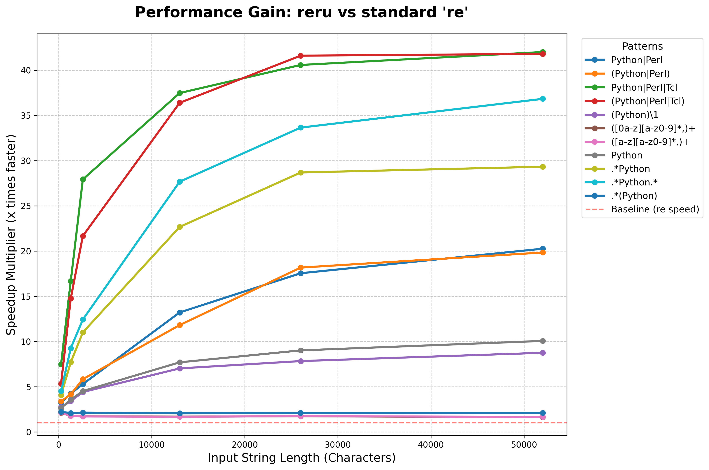

python benchmarks/benchmark.py 

# Benchmark

**Hardware Specifications:** Notebook Legion 5i, Intel(R) Core(TM) i7-10750H CPU @ 2.60GHz, 16GB RAM  
**OS Specifications:** Linux pop-os 6.18.7-76061807-generic

Running benchmarks (10000 iterations each)...

Noise padding: 130 characters added to target strings
| Pattern                   | re (sec)   | reru (sec) | Speedup | Selected Engine |
| --- | --- | --- | --- | --- |
|Python|Perl               | 0.0068     | 0.0020     | 3.41x | regex|
|(Python|Perl)             | 0.0067     | 0.0021     | 3.14x | regex|
|Python|Perl|Tcl           | 0.0143     | 0.0021     | 6.80x | regex|
|(Python|Perl|Tcl)         | 0.0143     | 0.0026     | 5.60x | regex|
|(Python)\1                | 0.0066     | 0.0022     | 2.92x | pcre2|
|([0a-z][a-z0-9]*,)+       | 0.0207     | 0.0098     | 2.12x | regex|
|([a-z][a-z0-9]*,)+        | 0.0215     | 0.0097     | 2.22x | regex|
|Python                    | 0.0058     | 0.0022     | 2.60x | literal_scan(pcre2) |
|.*Python                  | 0.0092     | 0.0023     | 4.04x | literal_scan(pcre2) |
|.*Python.*                | 0.0102     | 0.0023     | 4.44x | literal_scan(pcre2) |
|.*(Python)                | 0.0203     | 0.0092     | 2.21x | pcre2 |

Noise padding: 1300 characters added to target strings
|Pattern                   | re (sec)   | reru (sec) | Speedup | Selected Engine |
| --- | --- | --- | --- | --- |
Python|Perl               | 0.0137     | 0.0066     | 2.09x | regex
(Python|Perl)             | 0.0125     | 0.0025     | 4.95x | regex
Python|Perl|Tcl           | 0.0911     | 0.0036     | 25.57x | regex
(Python|Perl|Tcl)         | 0.0875     | 0.0040     | 21.91x | regex
(Python)\1                | 0.0143     | 0.0029     | 4.90x | pcre2
([0a-z][a-z0-9]*,)+       | 0.1313     | 0.0732     | 1.79x | regex
([a-z][a-z0-9]*,)+        | 0.1276     | 0.0730     | 1.75x | regex
Python                    | 0.0129     | 0.0028     | 4.56x | literal_scan(pcre2)
.*Python                  | 0.0318     | 0.0029     | 10.99x | literal_scan(pcre2)
.*Python.*                | 0.0377     | 0.0030     | 12.73x | literal_scan(pcre2)
.*(Python)                | 0.1436     | 0.0655     | 2.19x | pcre2

Noise padding: 13000 characters added to target strings
| Pattern                   | re (sec)   | reru (sec) | Speedup | Selected Engine |
| --- | --- | --- | --- | --- |
| Python|Perl               | 0.0618     | 0.0034     | 18.24x | regex |
| (Python|Perl)             | 0.0610     | 0.0034     | 17.96x | regex |
Python|Perl|Tcl           | 0.7879     | 0.0193     | 40.75x | regex
(Python|Perl|Tcl)         | 0.7822     | 0.0199     | 39.34x | regex
(Python)\1                | 0.0785     | 0.0096     | 8.21x | pcre2
([0a-z][a-z0-9]*,)+       | 1.1502     | 0.7045     | 1.63x | regex
([a-z][a-z0-9]*,)+        | 1.1527     | 0.7078     | 1.63x | regex
Python                    | 0.0851     | 0.0094     | 9.01x | literal_scan(pcre2)
.*Python                  | 0.2711     | 0.0097     | 28.09x | literal_scan(pcre2)
.*Python.*                | 0.3211     | 0.0094     | 33.99x | literal_scan(pcre2)
.*(Python)                | 1.3456     | 0.6307     | 2.13x | pcre2

